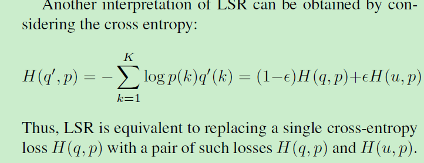

# Rethinking the Inception Architecture for Computer Vision

在论文开始，作者提出了一些通用的**调参经验和结构经验**。

* 通常而言，网络的表示大小应当从输入到输出递减。因为在网络中加大某一层也并不会带来相比之前更多的信息
* 高维的特征更容易处理，在高维特征上收敛更快。
* 底层的网络中进行通道的汇聚，这样做的损失并不大，作者认为底层的神经元之间的相关性较大，存在一定的冗余
* 应当平衡网络的深度和宽度，平衡的网络质量更高，并且在分布式计算中有合理有效的 computational budget

#### Smaller convolutions

在之前的inception net中每个inception含有集中不同大小的卷积核：3\*3，5\*5，7\*7。类比VGG的网络结构。其实就是通过将不同大小的卷积核都采用一系列的3\*3卷积核的叠加来替代。这样既可以达到相同的感受野范围，又可以减少参数。

这样做之后每层的3\*3卷积之后都加上了relu函数。作者通过实验证明，减少参数并没有带来性能的下降，还有加入relu函数的效果总比不加好一些。（如果参考VGG论文，因为叠加了更多的非线性函数，反而能够给网络带来更大的非线性表达能力，提高网络的性能）。

#### 更小的卷积核

在使用3\*3卷积核之后，作者提出了是否可以采用更加小的卷积核，2\*2，或者1\*n，n\*1这样的结构。例如通过1\*3和3\*1的叠加来代替3\*3卷积核。采用这种方式可以将参数减少33%。如下图

但是这种结构在实际操作中，在网络的浅层采用这种方式并没有带来很好的效果。在网络的中层，即feature map大小适中的时候采用这种结构，效果会比较好。这样inception的结构就变成了如下图：

#### Utility of Auxiliary Classifiers

在之前的inception net中提出了增加额外旁支分类器来提高网络的训练结果。

