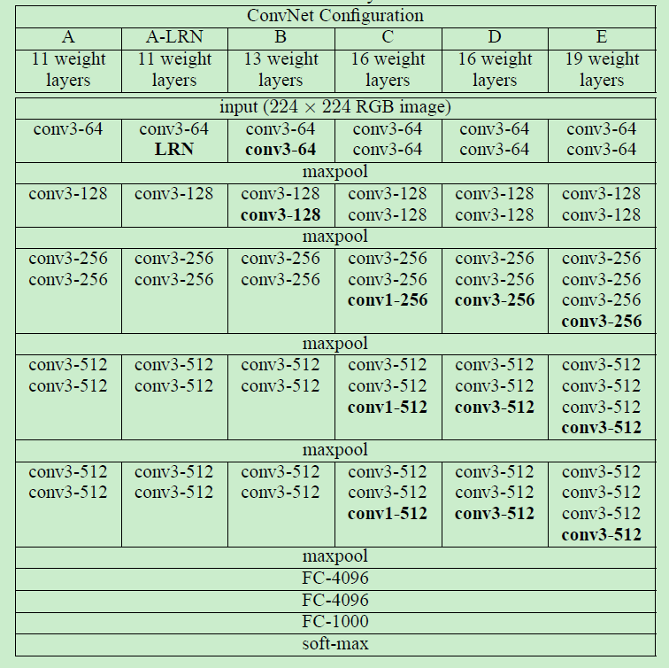
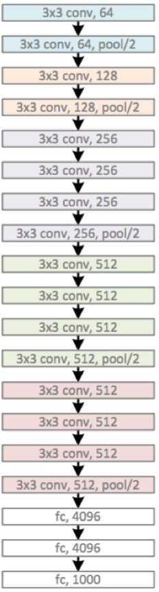

# No.1 VGG

VGG提出在整个网络结构中都使用简单的3\*3卷积核，以及maxpooling来组成基本的网络结构单元。通过叠加单元，在网络结构不变的情况下加深网络的深度，来达到当时的顶尖水平。

#### 论文中提出的结构示意图如下：

论文从提出采用3\*3卷积开始，通过与现有的7\*7，5\*5对比，发现虽然3\*3卷积核感受范围较小，但是通过级联若干层也可以达到与较大卷积核相同的事业范围。而且通过级联也带来了优势，多层的级联有助于非线性函数的性能增强（相当于将之前的单独激活函数变成了若干的激活函数级联，所以可以提升性能）具体如下：

#### 引入cs231n上面一段话：几个小滤波器卷积层的组合比一个大滤波器卷积层好：

假设你一层一层地重叠了3个3x3的卷积层（层与层之间有非线性激活函数）。在这个排列下，第一个卷积层中的每个神经元都对输入数据体有一个3x3的视野。第二个卷积层上的神经元对第一个卷积层有一个3x3的视野，也就是对输入数据体有5x5的视野。同样，在第三个卷积层上的神经元对第二个卷积层有3x3的视野，也就是对输入数据体有7x7的视野。假设不采用这3个3x3的卷积层，二是使用一个单独的有7x7的感受野的卷积层，那么所有神经元的感受野也是7x7，但是就有一些缺点。

首先，多个卷积层与非线性的激活层交替的结构，比单一卷积层的结构更能提取出深层的更好的特征。其次，假设所有的数据有C个通道，那么单独的7x7卷积层将会包含7\*7\*C=49C2个参数，而3个3x3的卷积层的组合仅有个3\*（3\*3\*C）=27C2个参数。直观说来，最好选择带有小滤波器的卷积层组合，而不是用一个带有大的滤波器的卷积层。前者可以表达出输入数据中更多个强力特征，使用的参数也更少。唯一的不足是，在进行反向传播时，中间的卷积层可能会导致占用更多的内存。

同时作者还提出了采用1\*1的卷积核，来单纯的提升非线性性能。在后续的模型测评中有队这种方法做比较。

### 在训练的过程中作者分步提出了改进的方法以及对比

首先是**深层网络的初始化**问题，深层的网络如果初始化不合适的话。在后续的训练中就会有梯度无法较好的下降的问题。所以作者提出了先构建一个浅层的网络训练（浅到可以直接采用随机初始化也可以训练到比较理想的结果。），再将浅层网络的训练结果载入深层网络对应的层作为初始化的方案。

还有对于输入的图片scale的选择问题，是否将所有的图片统一到统一scale。作者将两种方案都进行的训练并进行了对比。固定尺寸采用了256与384。首先训练256的网络，之后将训练得到的结果用于384的网络初始化来起到加速网络训练的作用。multi-scale采用了\[256，512\]之间的尺寸。同样为了加速训练采用了在single-scale训练结果上fine-tuning的放法来训练。

**在single-scale上的识别。**   

* 1.作者在训练的过程中发现加入local normalisation并没有对网络的效果有提升作用，所以在整个的训练中都没有加入BN层。
* 2.在训练中发现加深网络的层数有助于减少分类的错误率。
* 3.在对比了不同代销的卷积核之后，得出了3\*3的卷积核增加了非线性（上文所述）的确有助于提升准确率。
* 4.最后在采用了图像增强技术后（训练时多尺度的crop）也有助于提高多尺度图片的预测结果。

**模型融合带来的提升**

作者将多个模型融合后最后将各个模型的soft-max层的预测概率结果平均后作为最后的输出结果。也带来了一定的提升。

### 总结

整篇文章提出了在网络结构没有很大变化的前提下，通过将卷积核缩小为统一的3\*3然后提升网络的深度，来达到提高网络性能的作用。在论文中作者分享了使用VGG网络参加图像分类比赛中的每一步思路以及改变技巧。例如BN层是否加入，如何初始化，是否将输入scale统一以及采用图像增强技术。这些trick都有助于提升整个网络的性能。

现在主流的深度学习工具都已经有写好的vgg网络结构以及在imagnet或者各大公开数据集上训练好的权重文件。在使用中可以直接载入就ok

